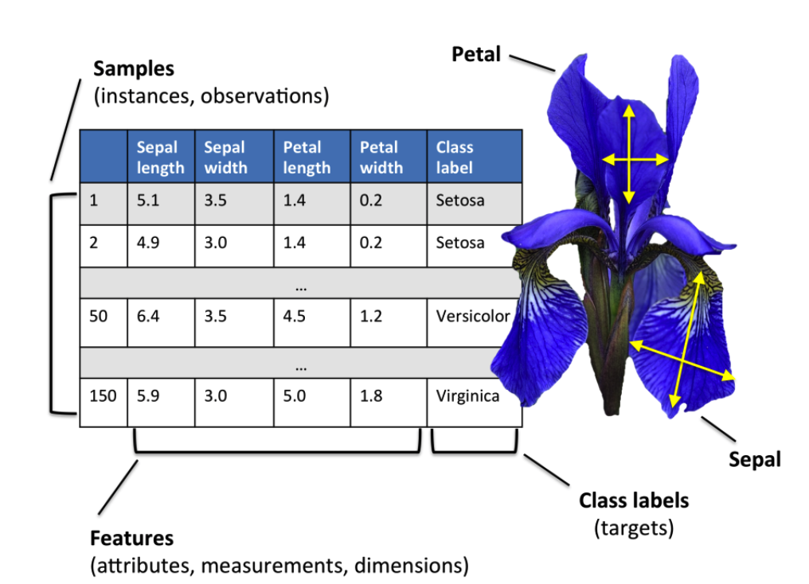

# Assignment 3

### Comparing classification models. Sklearn Iris dataset

1. Load library
2. Load dataset
3. Summarize data
4. Visualize data
5. Data pre-processing
6. Train models
7. Evaluate models on test dataset (print classification report)

### Summary
The Iris Dataset contains four features (length and width of sepals and petals) of 50 samples of three species of Iris (Iris setosa, Iris virginica and Iris versicolor). These measures were used to create a linear discriminant model to classify the species. The dataset is often used in data mining, classification and clustering examples and to test algorithms.
<div align="center">
    
    
</div>


### Graphs

Box plot | Histogram | Scatter matrix
:------------:|:------------: | :------------:
 |  | 


### Results

```
========================= LR =========================
The accuracy: 0.96
The Classification Report:
               precision    recall  f1-score   support

      Setosa       1.00      1.00      1.00        14
  Versicolor       0.95      0.95      0.95        19
   Virginica       0.94      0.94      0.94        17

    accuracy                           0.96        50
   macro avg       0.96      0.96      0.96        50
weighted avg       0.96      0.96      0.96        50

The Confusion Matrix:
 [[14  0  0]
 [ 0 18  1]
 [ 0  1 16]]

========================= CART =========================
The accuracy: 0.86
The Classification Report:
               precision    recall  f1-score   support

      Setosa       1.00      1.00      1.00        14
  Versicolor       0.80      0.84      0.82        19
   Virginica       0.81      0.76      0.79        17

    accuracy                           0.86        50
   macro avg       0.87      0.87      0.87        50
weighted avg       0.86      0.86      0.86        50

The Confusion Matrix:
 [[14  0  0]
 [ 0 16  3]
 [ 0  4 13]]

========================= KNN =========================
The accuracy: 0.96
The Classification Report:
               precision    recall  f1-score   support

      Setosa       1.00      1.00      1.00        14
  Versicolor       0.95      0.95      0.95        19
   Virginica       0.94      0.94      0.94        17

    accuracy                           0.96        50
   macro avg       0.96      0.96      0.96        50
weighted avg       0.96      0.96      0.96        50

The Confusion Matrix:
 [[14  0  0]
 [ 0 18  1]
 [ 0  1 16]]

========================= NB =========================
The accuracy: 0.94
The Classification Report:
               precision    recall  f1-score   support

      Setosa       1.00      1.00      1.00        14
  Versicolor       0.86      1.00      0.93        19
   Virginica       1.00      0.82      0.90        17

    accuracy                           0.94        50
   macro avg       0.95      0.94      0.94        50
weighted avg       0.95      0.94      0.94        50

The Confusion Matrix:
 [[14  0  0]
 [ 0 19  0]
 [ 0  3 14]]

========================= LDA =========================
The accuracy: 0.96
The Classification Report:
               precision    recall  f1-score   support

      Setosa       1.00      1.00      1.00        14
  Versicolor       0.95      0.95      0.95        19
   Virginica       0.94      0.94      0.94        17

    accuracy                           0.96        50
   macro avg       0.96      0.96      0.96        50
weighted avg       0.96      0.96      0.96        50

The Confusion Matrix:
 [[14  0  0]
 [ 0 18  1]
 [ 0  1 16]]

========================= SVM =========================
The accuracy: 0.94
The Classification Report:
               precision    recall  f1-score   support

      Setosa       1.00      1.00      1.00        14
  Versicolor       0.90      0.95      0.92        19
   Virginica       0.94      0.88      0.91        17

    accuracy                           0.94        50
   macro avg       0.95      0.94      0.94        50
weighted avg       0.94      0.94      0.94        50

The Confusion Matrix:
 [[14  0  0]
 [ 0 18  1]
 [ 0  2 15]]